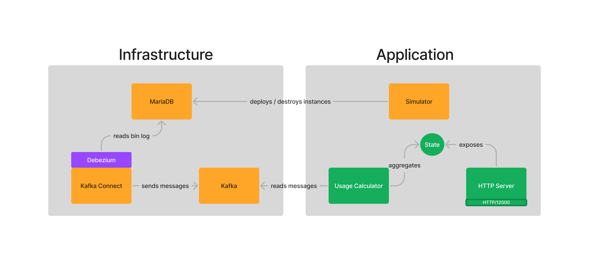

# Exoscale Assessement

## Context

Exoscale is a Cloud Provider that offers compute services, including the deployment 
of virtual machines (instances). These resources must be billed on a per-second 
basis.
Your mission is to develop a system that calculates the usage associated to 
instances deployment based on Change Data Capture.

## Prerequisites

- Make
- JDK 11+
- Recent version of [Docker](https://docs.docker.com/get-docker/)
- [Clojure Tools](https://clojure.org/guides/install_clojure)

## Overview

All infrastructure components are in place, including the simulator, whose 
responsibility is to generate usage on the platform (start and destroy 
instances).



Your objective is to implement the remaining parts in green.

## Getting started

The infrastructure can be set up by running the following command : 

```sh 
make compose-up
```

This will start all the necessary containers including registering the Debezium
connector to the MariaDB database.

The Clojure project is composed of a unique namespace `exoscale.assignement` 
with some requires already present.

Feel free to use the libraries of your choice, some have been included as a
default if you don't know where to start :
- [Java Kafka Clients](https://docs.confluent.io/kafka-clients/java/current/overview.html#ak-consume) to create Kafka consumers
- [Cheshire](https://github.com/dakrone/cheshire) to marshall/unmarshall JSON
- [Aleph](https://github.com/clj-commons/aleph) for the HTTP server

Before starting, you might want to read a bit about the [Debezium Connector for
MySQL](https://debezium.io/documentation/reference/stable/connectors/mysql.html).

## Features

To implement all the features below, please rely only on Change Data Capture.
You should consider you don't have a direct access to the MariaDB database (JDBC).

1. Create a Kafka Consumer with the configuration below and subscribe to the 
topic `topic.cloud.instances`.

- `bootstrap.servers` : localhost:9092
- `client.id` : localhost
- `group.id` : exoscale
- `group.instance.id` : exoscale.01
- `key.deserializer` : org.apache.kafka.common.serialization.StringDeserializer
- `value.deserializer` : org.apache.kafka.common.serialization.StringDeserializer
 
2. Implement `start-usage-calculator` which has to start another process (thread).
Initially, it has to count the number of instances that got started on the
Exoscale's platform per organization. This process should rely on Change Data Capture by 
consuming messages produced on the topic `topic.cloud.instances`.
Calculating a state in memory is entirely valid as persistence is not a required property.  
Hint : A started instance corresponds to an `INSERT` into the database.

3. Keep track of the running instances per organization (not only the number
of instances that got started but take into account the destroyed ones).  
Hint : A destroyed instance is deleted from the `instances` table.

4. Compute the billing of the instances once they __are destroyed__. The price
of an instance by second is stored in the `price_second` column and when it
got deployed on the `started` column.

5. Implement `start-server` which exposes the accumulated state on an HTTP endpoint (on port 12000). 
The usage should be aggregated per organization with the following fields :

- `started` : The number of started instances
- `running` : The instances that are still running on the platform
- `billing` : The billing associated to the instances that got stopped

Here is an example :

``` json
{
  "95f8a5e2-0807-448b-b2cd-102d78203c88": {
    "started": 11,
    "running": 1,
    "billing": 3025
  },
  ...
}
```

## Expectations

Running `make run` should start an HTTP server serving the current usage (since 
the application started).

``` json
❯ curl -sS http://localhost:12000/ | jq . -r  
{
  "95f8a5e2-0807-448b-b2cd-102d78203c88": {
    "started": 11,
    "running": 1,
    "billing": 3025
  },
  "ffb0ca88-123b-42f6-a2d2-b13f51dea292": {
    "started": 7,
    "running": 2,
    "billing": 2997
  },
  "74b23560-55b5-4e9e-9b51-a98097b817f6": {
    "started": 11,
    "running": 2,
    "billing": 2918
  },
  "37edc843-926f-47ca-9a08-bcc0a54dffd8": {
    "started": 4,
    "running": 1,
    "billing": 962
  },
  "0969af61-3d3b-4896-bd13-673f1a840170": {
    "started": 8,
    "running": 2,
    "billing": 3959
  }
}
```

A `watch` on the endpoint should return a live view of the organizations
consumption:

```
watch 'curl -sS http://localhost:12000/ | jq . -r'
```
